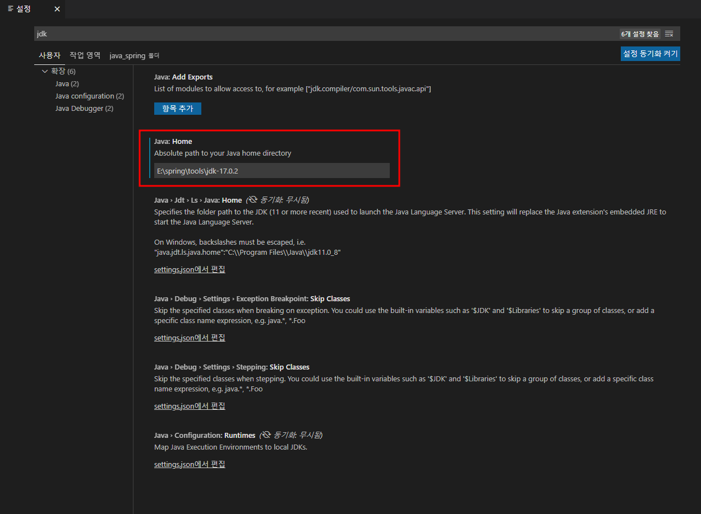

테스트 환경
==========================================================================================
* OpenJDK 17.0.2 다운로드
  * https://jdk.java.net/17/
* OpenJDK 압축풀고, 적당한 장소에 복사
  * E:\spring\tools\jdk-17.0.2
* Extension Pack for Java 설치
  * Ctrl+Shift+x 탐색
* VS Code에 OpenJDK 패스 설정
  * 파일 > 기본설정 > 설정 > 탐색창에서 jdk를 입력 > settings.json 편집로 진입
  * java.home 추가 (아래 참조)
 
  ```json
  {
    "editor.suggestSelection": "first",
    "vsintellicode.modify.editor.suggestSelection": "automaticallyOverrodeDefaultValue",
    "java.home":"E:\\spring\\tools\\jdk-17.0.2"
  }
  ```

